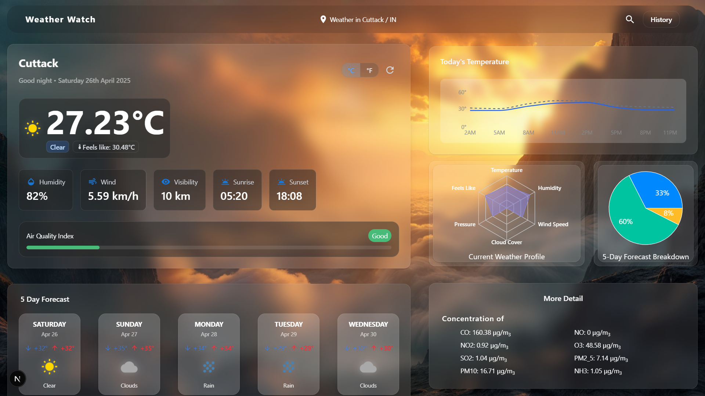

# Weather Watch

**Weather Watch** is a modern, responsive weather dashboard built using **Next.js 15** and **React 19**, providing real-time weather updates, forecasts, and visual insights in an interactive and user-friendly interface.



## ✨ Features

- **Real-time Weather Data:** View current conditions, 5-day forecasts, and air quality information.
- **Interactive Visualizations:** Analyze temperature trends, humidity levels, wind speed, and more with **Recharts** and **Chart.js**.
- **Geolocation Support:** Automatically detect user location with IP-based fallback.
- **Unit Conversion:** Easily toggle between Metric (°C) and Imperial (°F) units.
- **Global Search:** Search and view weather details for any location worldwide.
- **Responsive Design:** Fully optimized for mobile, tablet, and desktop devices.

## 🛠 Tech Stack

- **Framework:** Next.js 15 (App Router)
- **Frontend:** React 19, Tailwind CSS, Framer Motion
- **State Management:** Zustand
- **Data Visualization:** Recharts, Chart.js
- **API Integration:** OpenWeather API
- **Build Tool:** Turbopack

## 🚀 Getting Started

Follow these steps to run the project locally:

1. **Clone the repository:**
   ```bash
   git clone https://github.com/kaushik-2318/weather-watch.git
   cd weather-watch
   ```

2. **Install dependencies:**
   ```bash
   npm install
   # or
   yarn install
   ```

3. **Set up environment variables:**

   Create a `.env` file at the root of your project with the following contents:

   ```env
   NEXT_PUBLIC_OPENWEATHER_API_URL=https://api.openweathermap.org/data/2.5
   NEXT_PUBLIC_OPENWEATHER_API_GEO=https://api.openweathermap.org/geo/1.0
   NEXT_PUBLIC_OPENWEATHER_API_KEY=your_api_key_here
   ```

4. **Run the development server:**
   ```bash
   npm run dev
   # or
   yarn dev
   ```

5. Open [http://localhost:3000](http://localhost:3000) in your browser to see the app in action.

## 📚 Learn More

Here are some useful resources to learn more about the technologies used:

- [Next.js Documentation](https://nextjs.org/docs)
- [React Documentation](https://react.dev/)
- [Tailwind CSS Documentation](https://tailwindcss.com/docs)
- [Framer Motion Documentation](https://www.framer.com/motion/)
- [OpenWeather API Documentation](https://openweathermap.org/api)

## 📄 License

This project is licensed under the Creative Commons Attribution-NonCommercial 4.0 International License.
See the [LICENSE](./LICENSE) file for more information.

## 👨‍💻 Author

**Kaushik Verma**  
[LinkedIn](https://www.linkedin.com/in/kaushik-verma-2b5515254/) | [Portfolio](https://kaushikverma.me/)